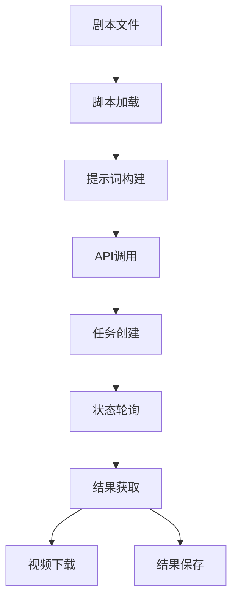

# 剧本转视频实践总结

参考官方文档[Seedance SDK 示例官方教程-方舟大模型服务平台-火山引擎](https://www.volcengine.com/docs/82379/2298881?redirect=1\&lang=zh)

## 1. 实践概述

本次实践成功实现了从剧本文本到视频的自动化生成流程，使用火山引擎 Ark 平台的 Doubao-Seedance-1.5-pro 模型，通过 API 调用生成高质量的视频内容。

### 1.1 目标

- 验证剧本转视频的技术可行性
- 建立完整的工作流程
- 为项目提供视频生成能力

### 1.2 技术栈

- **后端**：Python + 火山引擎 Ark SDK
- **模型**：Doubao-Seedance-1.5-pro-251215
- **存储**：本地文件系统

## 2. 技术方案

### 2.1 架构设计



### 2.2 核心组件

1. **脚本加载模块**：从本地文件读取剧本内容
2. **提示词构建模块**：将剧本转换为适合视频生成的提示词
3. **API调用模块**：与火山引擎 Ark 平台交互
4. **任务管理模块**：创建和监控视频生成任务
5. **结果处理模块**：提取视频 URL 和保存结果

## 3. 实现步骤

### 3.1 环境准备

1. **安装依赖**：
   ```bash
   pip install 'volcengine-python-sdk[ark]'
   ```
2. **配置环境变量**：
   ```powershell
   $env:ARK_API_KEY = "你的API密钥"
   ```

### 3.2 脚本实现

1. **主脚本** (`api-demo/script_to_video_v2.py`)：
   - 加载剧本文件
   - 构建视频生成提示词
   - 创建视频生成任务
   - 轮询任务状态
   - 提取视频 URL
   - 保存结果
2. **查询脚本** (`api-demo/query_task.py`)：
   - 查询指定任务的状态和结果
   - 提取视频 URL
   - 保存完整结果

### 3.3 剧本格式

剧本文件 (`api-demo/script.txt`) 采用纯文本格式，包含：

- 场景描述
- 人物信息
- 对话内容
- 动作描述

**示例剧本**：

```
场景：咖啡厅
人物：小明（男，25岁，程序员）、小红（女，23岁，设计师）

小明走进咖啡厅，看到小红坐在窗边，抬手笑着打招呼。嘿，小红！这边坐啊？
小红抬头微笑，是啊，等你半天了，快坐。
小明坐下，有点不好意思，路上有点堵。你点什么了？
小红指了指桌上的咖啡，美式，给你也点了一杯。
小明感激地，谢谢，你真好。对了，上次说的项目怎么样了？
小红皱了皱眉，有点棘手，客户要求改了又改，我都快烦死了。
小明身体前倾，认真地安慰，别着急，慢慢来，总能解决的。需要我帮忙吗？
小红眼睛亮了亮，真的？那太好了！
```

## 4. 结果分析

### 4.1 生成效果

- **视频质量**：720p 分辨率，16:9 比例，画面清晰
- **音频效果**：支持有声视频，包含对话、音效和背景音乐
- **内容准确性**：基本还原剧本场景和对话
- **生成时间**：约 2 分钟

### 4.2 成功案例

**任务ID**：cgt-20260425121230-c7t4x

- **状态**：成功
- **视频URL**：已生成（详见任务结果）
- **生成时长**：10秒
- **分辨率**：720p

### 4.3 错误处理

- **API密钥错误**：确保环境变量 ARK\_API\_KEY 正确设置
- **模型未激活**：需要在 Ark 控制台激活对应模型
- **账户余额不足**：确保账户余额大于等于 200 元
- **提示词过长**：提示词长度控制在建议范围内

## 5. 收获与建议

### &#x20;建议

1. **提示词优化**：
   - 保持提示词简洁明了，控制在 500 字以内
   - 详细描述场景、人物和动作
   - 使用双引号标记对话内容
2. **参数调优**：
   - 分辨率：根据需求选择 720p 或 1080p
   - 时长：建议 4-10 秒，平衡质量和成本
   - 音频：根据场景选择是否生成音频
3. **错误处理**：
   - 添加更完善的错误处理机制
   - 实现自动重试功能
   - 监控任务状态和生成进度
4. **集成建议**：
   - 与项目的其他模块集成
   - 实现批量处理功能
   - 添加用户界面，方便操作

## 6. 使用教程

### 6.1 基本使用

1. **准备剧本**：
   - 在 `api-demo/script.txt` 中编写剧本内容
   - 按照场景、人物、对话的格式组织
2. **设置环境变量**：
   ```powershell
   $env:ARK_API_KEY = "你的API密钥"
   ```
3. **运行脚本**：
   ```powershell
   python "api-demo/script_to_video_v2.py"
   ```
4. **查看结果**：
   - 脚本会显示任务状态和视频 URL
   - 完整结果保存在 `api-demo/video_result.json`

### 6.2 高级用法

1. **查询历史任务**：
   ```powershell
   # 修改 query_task.py 中的 task_id
   python "api-demo/query_task.py"
   ```
2. **自定义参数**：
   - 修改 `script_to_video_v2.py` 中的参数
   - 如 resolution、duration、generate\_audio 等
3. **批量处理**：
   - 扩展脚本，支持处理多个剧本文件
   - 实现批量生成视频的功能

### 6.3 常见问题

**Q: 视频生成失败怎么办？**
A: 查看错误信息，检查 API 密钥、模型激活状态和账户余额

**Q: 提示词多长合适？**
A: 中文建议不超过 500 字，英文不超过 1000 词

**Q: 如何提高视频质量？**
A: 详细描述场景、人物和动作，使用清晰的提示词

**Q: 生成的视频没有声音？**
A: 检查 generate\_audio 参数是否设置为 True

## 7. 未来计划

1. **前端集成**：开发用户界面，方便用户上传剧本和查看生成结果
2. **模型优化**：尝试不同的模型和参数组合，找到最佳配置
3. **功能扩展**：支持更多视频生成模式，如图生视频、多模态输入
4. **性能优化**：提高生成速度和视频质量

***

**结论**：本次实践成功实现了剧本转视频的技术方案，为项目提供了视频生成能力。通过合理的提示词构建和参数设置，可以生成高质量的视频内容，满足项目的需求。
